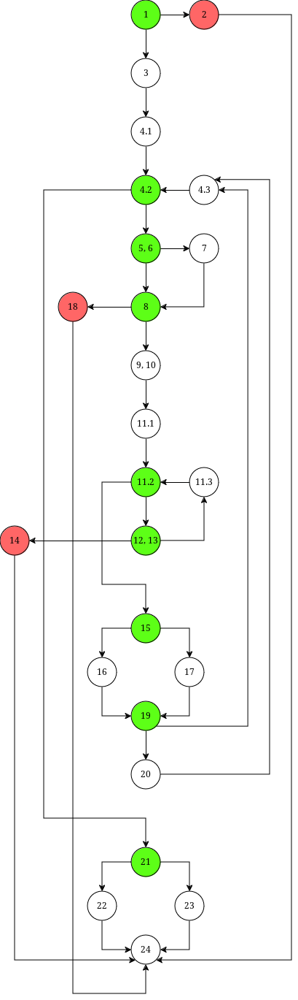
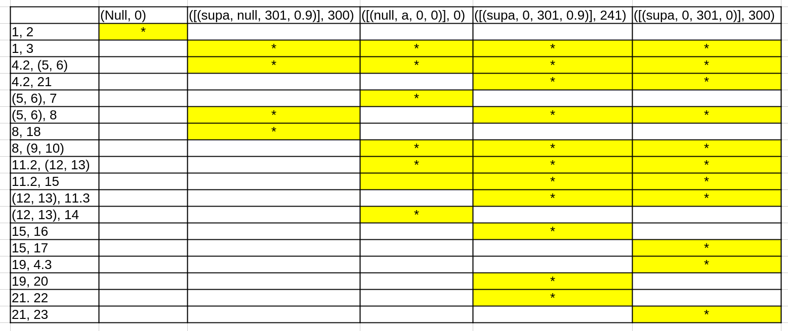
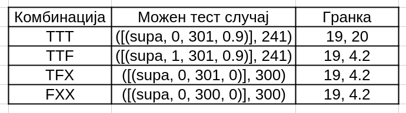

# SI_2024_lab2_216036
___
## Сара Конин, 216036
___
### 2. Control Flow Graph

### 3. Цикломатска комплексност
Цикломатска комплексност е 9. Се добива на 2 начини:\
V(G) = E - N + 2 = 33 - 25 + 2 = 10, кај што E е број рабови, а N број јазли.\
V(G) = P + 1 = 9 + 1 = 10, кај што P е број предикатни јазли
(јазли кои се гранат 2 или повеќе пати).

### 4. Тест случаи според Every Branch критериум
Потребни се минимум 5 теста: 3 за исклучоците, и уште 2 за да се поминат другите предикатни јазли. \
Тест случај (allitems, payment) и соодветен пат во граф:
* (Null, 0) : 1, 2, 24
* ([(supa, null, 301, 0.9)], 300) : 1, 3, 4.1, 4.2, (5, 6), 8, 18, 24
* ([(null, a, 0, 0)], 0) : 1, 3, 4.1, 4.2, (5, 6), 7, 8, (9, 10), 11.1, 11.2, (12, 13), 14, 24
* ([(supa, 0, 301, 0.9)], 241) : 1, 3, 4.1, 4.2, (5, 6), 8, (9, 10), 11.1, 11.2, (12, 13), 11.2, 15, 16, 19, 20, 4.3, 4.2, 21, 22, 24
* ([(supa, 0, 301, 0)], 300) : 1, 3, 4.1, 4.2, (5, 6), 8, (9, 10), 11.1, 11.2, (12, 13), 11.2, 15, 17, 19, 4.3, 4.2, 21, 23, 24

Услови кои ги покрива секој тест:
1. allitems == null
2. item.getBarcode() == null
3. item.getBarcode() != null, allowed.indexOf(c) == -1, item.getName() == null
4. item.getBarcode() != null, item.getDiscount() > 0,  item.getPrice() > 300, item.getBarcode().charAt(0) == '0', sum <= payment
5. item.getBarcode() != null, item.getDiscount() <= 0, item.getPrice() > 300, item.getBarcode().charAt(0) == '0', sum > payment

Табела:

### 5. Тест случаи според Mutiple Condition критериум
Има вкупно 8 можности (2^3), но со Lazy Evaluation доволно е да се проверат 4, зашто поради && откако еден услов ќе падне вистинитосната вредност на наредните не влијае на исходот.\
Табела:\
Наредба: if (item.getPrice() > 300 && item.getDiscount() > 0 && item.getBarcode().charAt(0) == '0')
